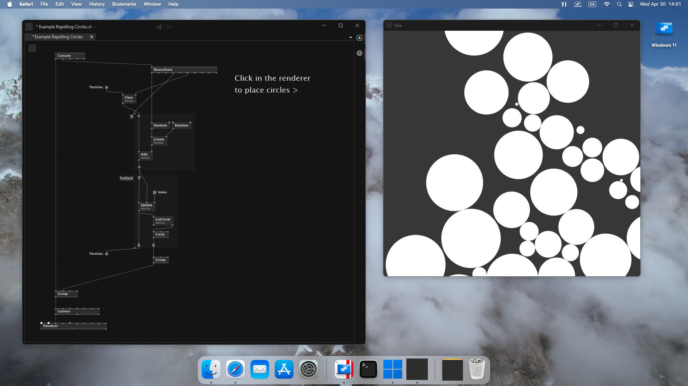

# Running vvvv on a Mac

vvvv does not have a native version for macOS!

**But**: There are ways to get it running on macOS without noticable performance issues on recent Mac hardware. 

> We're testing on a Mac mini with Apple M4 chip and 24GB of ram running macOS Sequoia. Therefore this article is only talking about using modern Arm based Apple silicon CPUs and not Apples legacy intel-based chips!

## Parallels

[Parallels](https://www.parallels.com/de/products/desktop) allows you to run Windows in a virtual machine on macOS. Installation of Parallels, including Windows takes < 30min. When set-up, make sure to download and install the [Arm build of vvvv](vvvv-on-arm.md).

We're testing with Version 20 of Parallels. 

### Known issues
Right-draging an IOBox or input pin sometimes fails. Changing the following setting in Parallels, fixes this:

    Your Virtual Machines Configuration > Hardware > Mouse & Keyboard > Mouse: Optimize for games

## Other Options

For other, as of this writing more experimental ways, see [this forum thread](https://forum.vvvv.org/t/vvvv-on-macos-and-linux/24159). 

## Limitations
Unfortunately some libraries are not working with Arm builds of vvvv, for details see: [vvvv on Arm](vvvv-on-arm.md).
